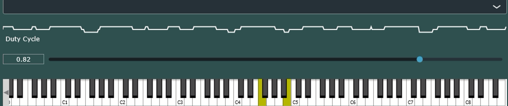

Pulse wave synthesizer using c++/Juce. Slider lets you vary the duty cycle. Should also support midi input devices too.

Code uses the following juce modules:
```
audio_basics
audio_devices
audio_formats
audio_processors
audio_utils
core
data_structures
dsp
events
graphics
gui_basics
gui_extra
```